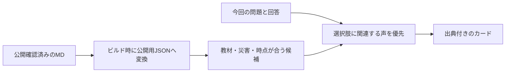

# 被災者の声をTips・クイズの振り返りへ反映する仕組み

更新日：2026-09-15。**初期版を実装済み。追加のプロフィール質問はありません。** 家族構成・住まいの一致による選択、自動の資料収集・要約生成は将来の検討事項です。

## 1. 現在の表示

内閣府「一日前プロジェクト」の6エピソード（VOICE-001・002・003・004・005・011）から、原典と掲載文を確認した7カードを使用します。同じVOICE-001の学校での行動と帰宅後の室内被害を別カードにしており、7人の証言という意味ではありません。

| 表示先 | 選び方 |
| --- | --- |
| 解析待ちの防災Tips | 表示中のTipsへ関連付けた資料。まだ回答がないため個人の傾向は使わない |
| 室内クイズの振り返り | 教材と選択肢の対応表から、その回答に関連する経験を優先 |
| 避難体験の振り返り | 災害種別とイベントIDを照合し、その場面に関連する経験を表示 |

現在の対象は、室内の机・床の散乱・情報確認、Tipsの家具配置・避難先確認・家族との連絡・道具の電池点検、避難の低い道・冠水・情報確認・電池です。全問題・全Tipsに証言が付くわけではありません。

カードには「被災者の声（要約）」、災害・年月・地域、短い要約、今回の教材とのつながり、原典へのリンクを表示します。背景・適用条件・参照箇所・加工主体はカード内で展開して読めます。子ども向け／大人向けの掲載文と、既存のふりがな・文字サイズ設定を使えます。

複数候補がある場合は「別の経験を読む」で切り替えられます。詳細を開いたり出典へ移動したりすることは、次の問題・振り返りへ進む条件にしません。

## 2. 追加質問なしで選ぶ

### 使用する情報

- 室内：保存した問題と `Session.answers` の `questionId`・`choiceId`・`timedOut`。
- 避難：`EvacSession.decisions` と、その判断に対応するイベント・選択した災害。
- Tips：表示しているTipsの固定ID。

本人の年齢・家族構成・住まい・性格は推測しません。点数だけで選択を分類せず、今回の問題で何を選んだかを使います。`Settings.audience` は表示用であり、本人の年齢ではありません。写真や位置情報から個人属性を補完しません。

### 選択の順序

1. 教材キー、画面、災害、時点が登録された条件と一致する資料に絞る。
2. 本人が回答した選択肢に明示的に関連付けられたカードを優先する。
3. 同じ順位ならカードIDで順序を固定する。再レンダーのたびに変えない。
4. 選択肢に合う資料がなければ、同じ教材に関連する通常の資料を出す。
5. 教材に関連する資料自体がなければカードを出さず、通常の解説を表示する。

時間切れや未知の選択肢は、本人が選んだ行動と照合しません。内部に選択肢IDが残っていても、時間切れフラグを優先します。今回の回答と結び付いたカードは「今回選んだ行動とのつながり」、共通の関連資料は「このテーマとのつながり」と表示します。

情報確認の問題（`q5`）では、「verify」はテレビ・ラジオによる情報収集の経験を、「share」「panic」は母娘が不確かな情報に戸惑った経験を優先します。後者は外部へ噂を拡散した記録や、それによる物的被害の証明ではなく、その限界も掲載しています。

回答・問題・時間切れの状態が変わると、選択した別カードと開いた詳細をリセットします。ページを再読み込みした場合は、その保存済み回答に対応する最優先のカードから表示します。別セッションの行動履歴や人物像を蓄積する処理はありません。

## 3. 出典と、異なる条件の扱い

- 掲載文は要約です。本人の原文引用として表示せず、原典や本人が編集文を承認したかのように示しません。
- 事実・本人の振り返り・教材との関連を分けます。体験談だけで既存の選択肢・採点を変更しません。
- 地震の資料を洪水の問題へ出す等の災害種別の取り違えは、生成処理と表示時の両方で防ぎます。
- 学校での机の経験は学校で起きたと明示し、利用者の家での実績にはしません。
- 棚の固定と中の本の散乱は別の出来事として記載し、出口の閉塞やけがを付け足しません。
- 洪水の低い道路の問題には、車でアンダーパスへ入った記録を道路の状況を考える補足として表示します。車の経験であり徒歩とは条件が異なることを明示し、脱出手順は掲載しません。
- 初回Tipsは備えの話題のため、資料自体は災害時の経験でも、その経験から考える準備のテーマを明記して関連付けます。

掲載した6件の個別原典、内閣府のシリーズ利用案内、東京消防庁「地震 その時10のポイント」の行動指針を2026-09-15に確認しました。各原典のURLと確認箇所はノート・カードに記録しています。原典確認は独立した因果検証や専門家による承認を意味しません。

## 4. ファイル構成

| ファイル | 役割 |
| --- | --- |
| `knowledge/voices/voice-*.md` | 原典ノートと、確認済みのアプリ掲載文・関連先を記録 |
| `knowledge/SOURCES.md` | 出典IDと原典URLの台帳 |
| `knowledge/voices/SOURCES.md` | 利用条件の確認記録 |
| `src/data/knowledge-contexts.json` | 教材キー・画面・災害・時点・選択肢IDの一覧 |
| `scripts/build-voice-knowledge.cjs` | MDの参照・確認状態・版を検証して公開用JSONを生成 |
| `src/data/generated/voice-knowledge.json` | 生成物。手で編集しない |
| `src/lib/voice-knowledge.ts` | 条件照合・回答に応じた候補の並べ替え |
| `src/components/SurvivorVoice.tsx` | 3画面で使う共通カード |

室内で動的に生成する机・床の問題には、`Question.knowledgeKey` を生成時に設定します。固定問題は既存の `q3`・`q5`、避難問題は `walk-case-*`、Tipsは追加した `tip.*` のIDを使います。タイトルの部分一致や選択肢の並び順では結び付けません。

`knowledgeKey` のない以前の動的な問題は、通常の振り返りを表示できますが、新しい声のカードは付きません。固定問題のIDはそのまま参照できます。

`HazardEvent.evidence` は地理的な根拠用のフィールドとして維持します。証言は別の公開データから選び、出題場所の根拠・推奨行動の根拠・過去の経験の出典を混ぜません。

## 5. MDを追加・更新する手順

### 収集と掲載を分ける

[体験ノートのひな形](../knowledge/templates/experience-note.md)や[収集スキル](../skills/collect-survivor-voices/SKILL.md)でMDを追加します。原典を確認しただけのノートは `review_status: source_checked`、`publication_status: draft` にします。下書きを追加しても画面の掲載内容は変わりません。

現在は、登録済みの選択肢IDと公開用カードを直接対応させる方式です。テンプレートの `decision_context` や `matching_context` は編集時の情報であり、自動で画面の選択条件へ変換しません。

### 掲載文を確認する

1. 掲載先の教材キー・選択肢・災害・時点を `src/data/knowledge-contexts.json` で確認する。新しい教材なら登録し、実際の設問の意味・条件も照合する。
2. ノート末尾へ `APP_KNOWLEDGE` マーカーで囲んだJSONブロックを作る。[VOICE-001](../knowledge/voices/voice-001-books-after-shaking.md)が記入例。
3. カードの `factIds` を本文の事実IDに結び付ける。`summary` と `limits` は `child`・`adult` の両方を記入する。`context` に経験の場面、`locator` に原典の該当箇所を記入する。
4. `bindings` に教材の `key` と `relation` を記入する。特定の選択肢へ関連付けるときだけ `choices` にIDを列挙する。省略した関連付けは、その教材の共通候補。
5. 出典・掲載文・条件・利用案内・対応先を確認し、ノートの `publication_status` とブロックの `review.status` を `approved` にする。確認日と確認者も記録する。
6. `npm run knowledge:fingerprints` で確認値を表示し、各ブロックの `review.digest` へ記入する。このコマンドは確認値を表示するだけで、掲載状態やファイルを自動更新しない。
7. `npm run knowledge:build`、`npm run knowledge:check` を実行する。対象画面を確認し、配布環境へビルド・デプロイする。

生成処理は依存パッケージを追加せず、Node.jsで実行します。一行形式の必要なメタデータと明示されたJSONブロックだけを読みます。汎用YAMLの全形式を解釈する処理ではないため、既存ノートの形式に合わせて記入してください。

### 更新・取り下げ

ノート本文、出典台帳の該当行、利用条件の記録、掲載文・関連先、登録した教材条件、確認者・確認日から確認値を計算します。確認後に変更があれば、再確認するまで生成処理を失敗させます。ID重複、出典・事実・選択肢の参照切れ、非HTTPSの原典URLも検出します。

取り下げはノートの `publication_status` を `withdrawn` にし、再生成・再配布します。ノートは削除せず、理由を収集ログへ残します。既に開いているページには再読み込みまで旧データが残り得ます。

`npm run dev` と `npm run build` の開始前に生成・検証します。開発サーバー起動中のMD変更は自動監視していないため、`npm run knowledge:build` を実行してください。`npm test` の開始前には、確認値と生成物が最新かを検証します。

公開データへ渡すのは掲載文・出典・経験の場面・関連先です。年齢・家族構成等の属性レコード、収集用の本文全体、編集上の人物分析は含めません。選択はブラウザー内で行い、回答を照合のために外部AIへ送りません。

## 6. 検証と今後

検証内容は、回答による優先順位、時間切れ・未知の選択、災害・時点の不一致、動的問題と選択肢の並べ替え、下書き・取り下げ・参照切れ、確認値の失効です。画面ではスマホ3サイズ、出典と詳細、回答保存、資料がない問題、Tipsの切り替え、洪水での条件差を確認します。最新の実行結果はREADMEに記載します。

今後の候補は、資料の拡充、回答後のTips、候補間の重複を減らす選択、原文引用の専用表示、家族構成・住まいを本人が任意で選ぶ機能です。現在の回答から本人の境遇や性格を推定する機能はありません。
