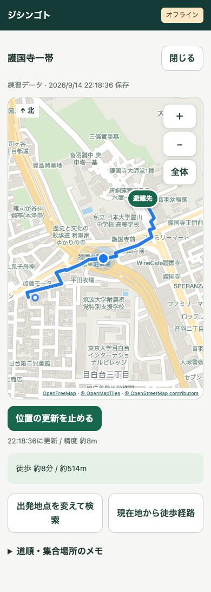

# 保存したマップ：圏外で現在地と経路を見る

`origin/main`（`5f9d442`）を統合した作業ブランチで実装。元の作業フォルダにある別の未コミット作業は、この変更には含めていない。

## 利用の流れ

1. `/evac?mode=api` でPlaces UI Kitの建物名検索または現在地から出発地点を指定し、近くの避難先を候補から選ぶ。候補は公的な指定緊急避難場所データから距離順に最大5件を表示する。名称・区分・距離を確認できる。
2. 避難体験を終えたリザルト `/evac/report` は地図を表示せず、番号付きの判断一覧で振り返る。「オフライン用の避難地図を作成」で保存専用ページ `/evac/save` を開く。出発地点・取得元と期限・避難先・選んだメモが引き継がれる。
3. 道路中心の保存用マップと徒歩経路を確認して保存する。Googleの道順とは異なる場合があることを保存前に表示する。
4. 「保存したマップを開く」から専用ページ `/offline-evac/index.html?route=登録ID` を開く。通常の入口をホーム画面へ追加できる。専用ページのブックマークも利用できる。
5. 「現在地からこの避難所へ」で、選んだ避難先までの徒歩経路を現在地から端末内で再計算する。「マップ一覧へ」で一覧へ戻り、別の保存マップを開ける。
6. 圏外でも専用ページを再読み込みすると、地図と保存した経路が開く。「現在地を表示」を押すと同じ地図上に現在地の青いマーカーを表示し、位置を更新する。停止ボタンで終了できる。

通常の入口 `/`・`/home` や体験のURLを圏外で新しく開くと、保存したマップへ転送する。保存が1件なら地図を直接表示し、複数なら一覧、未保存なら空状態を表示する。オンライン復帰後に通常のURLを開けば従来の画面を返す。入口・ホームを表示中にオフラインになった場合も切り替える。

ホームには「保存したマップを見る」を追加。保存画面からゲームへ移る「避難先を選ぶ」は削除し、オフラインでも保存した地図・経路・現在地を確認できることを目立つ案内にした。旧来の国土地理院地図への手動登録・編集画面、およびユーザーが不要とした「使う前に」の説明欄は削除した。

## 保存する地図

OpenFreeMapが配信するOpenMapTiles形式のOpenStreetMapベクトル地図を利用する。道路・建物・公園・水域・鉄道・道路名・地名・施設名をMapLibre GL JS 6.9.0で描画する。国土地理院の地図画像は表示・保存しない。国土地理院の公的避難先データは、Googleマップに表示する候補の情報源として引き続き使用する。

ズーム12・13・14の地域データを保存し、詳細な表示はズーム19まで拡大する。俯瞰用の地図も保存するため、縮小しても地図を表示できる。登録は最大5件、1件の地図は最大64タイル・16MB。ダウンロードは同時4件、60秒で中断し、壊れたPBF応答・途中の通信断・容量不足を成功として扱わない。描画用のMapLibre本体・共通モジュール・Worker・CSSも専用Service Workerで保存する。文字は端末のフォントで描くため、圏外時に地名用フォントを取得しない。

地図パックと道路グラフ・経路・名前・保存日・出典・メモをIndexedDBの1レコードへ、単一トランザクションで保存する。保存専用ページのプレビュー時に地図取得を済ませ、保存ボタンで端末内に確定する。同じ出発地点・避難先・災害種別・練習／実データ区分は、体験日時が違っても同じマップとして更新する（座標は小数5桁）。既存の重複も最新の1件へ統合し、以前のIDは別名として保持して古いリンクを開けるようにする。削除と新しい保存は単一トランザクションで、更新なら5件の上限に達していても保存できる。失敗時は以前の記録を残す。

旧版の保存データは保持するが、地理院地図へ戻して表示する代わりに、新しい道路地図で保存し直す案内を出す。

## 保存プレビューと補助データ

保存時に道路グラフの範囲内の指定緊急避難場所も保存する。災害種別はリザルトから引き継ぎ、地震はskhb04、洪水はskhb01のz10 GeoJSONから対応フラグを確認する。範囲を覆う最大4タイルを取得し、1応答4MB・3万件まで、15秒で中断する。範囲外・重複・不正座標を除外する。指定避難所の開設情報ではない。

周辺データは地図・道路と同一レコードに保存し、取得失敗時は保存完了にしない。周辺候補の検索・追加保存ボタンは表示しない。現在地の測位拒否・保存範囲外・経路がつながらない場合は案内できない旨を表示する。現在地から選択中の避難先への経路計算では外部通信を行わない。

保存プレビューは専用ページのヘッダーと説明の下に表示し、地図領域が残りの高さに伸びる。地図・道路・避難先を並行取得し、地図は取得でき次第描画する。同じ記録・出発地点・避難先で再度開いた場合は既存の地図と道路を再利用する。地図の描画中は読み込み表示を出す。

## 現在の操作（2026-09-15更新）

保存したマップでは「現在地からこの避難所へ」だけを経路操作として表示する。別の避難先の検索・候補選択・周辺候補の追加保存は画面から外した。地図と経路の保存・一覧・現在地表示は引き続き利用できる。保存時の周辺候補データの取得・保存形式は互換性のため維持している。「マップ一覧へ」で一覧に戻り、別の保存マップを選べる。過去の検証に登場する周辺検索は旧実装の記録。

## 今後の拡張（Future work）

自宅・会社・学校の登録、および会社／学校から自宅への徒歩コースは現在の提供対象から外した。選択画面・ホーム・保存マップには登録ボタンや帰宅コースを表示しない。以前の `/places` URLは保存マップの一覧へ転送する。

現在は、シミュレーションで選んだ避難先への経路と周辺地図をリザルトから保存し、最大5件の保存マップを一覧から開く流れを提供する。試作時に保存済みのデータは削除せず、過去の帰宅マップは保存時の地点への経路として引き続き開ける。

## 現在地と経路

地図・現在地・保存経路は同じ地図上に表示する。保存マップを開くと一覧や導入文を隠し、地図を広く表示する。地図の移動・ピンチやボタンでの拡大縮小・全体表示を利用できる。

「現在地を表示」でGeolocationのwatchPositionを開始する。最初は地図を現在地に移動し、以降は表示範囲を保ちながらマーカーを更新する。取得時刻・精度を表示する。一時的な測位エラーでは古いマーカーを消して次の更新を待ち、権限拒否・停止ボタン・ページ離脱では監視を終了する。地図の自動追従、移動に合わせた自動経路変更、音声案内は未実装。GPSが圏外でも測位できるかは端末・場所・権限に依存する。

道路はOverpass APIから取得したOSMの歩行可能な道路を使う。道路の共有ノードを接続しDijkstra法で距離の短い経路を求める。道路形状に25m以下間隔の補助点を置き、ピンから80m以内の最寄り道路点へ接続する。補助点で立体交差など別の道路を誤って接続しない。ピンから道路までの区間は経路として捏造しない。

徒歩禁止・高速道路・私有地・条件付き通行・閉じたゲート等を保守的に除外し、歩行者の一方通行を扱う。OSMのすべての規制・relation・路面・勾配には対応せず、階段を含む場合がある。車椅子用ルートではない。範囲外・道路なし・未接続の場合は検索失敗とし、架空の直線経路で置き換えない。保存範囲内では現在地からの再検索も可能。手動で出発地点を指定する操作と番号付きの道順一覧は削除した。再検索結果は表示中のみで、再訪問時は登録時の経路へ戻る。

道路応答は12MB・15万要素、加工後8万ノードまで。取得は45秒で中断。実際の通行止め・危険箇所・避難所の開設状況は反映しない。徒歩時間は平常時の分速70mの目安。練習モードで保存した記録は練習データと表示する。

## データと配信先

保存用iframeと保存専用ページは同一オリジンで、メッセージのオリジン・送信元ウィンドウを検証する。親から渡すのは出発地点・取得元と期限・行き先（公的避難先または登録した自宅）・コースの識別情報・選択したメモ・災害種別だけ。Googleの地図画像・経路座標・Street View履歴をコピー・保存しない。

- 検索時：Places UI Kitで出発地点を取得。検索結果の座標は取得から30日までとし、再保存で期限を延長しない。期限後は新規保存・表示を拒否し、起動時・起動中の確認で削除する。閉じているブラウザ内の即時削除はできない。Google地図タップ・旧検索由来の地点は保存前に再選択が必要。
- 保存専用ページへは通常のページ遷移で移動し、体験中のGoogle Maps SDKを引き継がない。体験から別地図への導線について、ページ分割だけで規約適合を保証するものではない。
- 保存用道路の準備：対象地域の矩形範囲をOverpass APIに送信。
- 保存用地図の準備：OpenFreeMapへ対象タイルの座標を送信。
- 保存済み地図の表示：MapLibreのカスタムプロトコルでIndexedDB由来のPBFを返す。地名用フォント・外部スタイル・外部地図サーバーを要求しない。経路の再計算も端末内。

公開配信サービスは可用性の保証がなく、特にOverpassの一般公開インスタンスを多数の本番ユーザー向け基盤にしない。本番ではODbLに対応した道路配信・更新の仕組みを用意する。試作は明示操作時だけ小範囲を取得し、大量取得や自動リトライはしない。

- [OpenFreeMapと出典表記](https://openfreemap.org/)
- [OpenMapTiles](https://openmaptiles.org/)
- [OpenStreetMapの著作権・ODbL](https://www.openstreetmap.org/copyright)
- [Overpassの共有資源としての利用方針](https://dev.overpass-api.de/overpass-doc/en/preface/commons.html)
- [Google Maps JavaScript APIの保存・表示条件](https://developers.google.com/maps/documentation/javascript/policies)
- [国土地理院・指定緊急避難場所データ](https://www.gsi.go.jp/bousaichiri/hinanbasho.html)

## 起動・保守

通常の `npm ci` / `npm run dev` で起動する。登録は既存の `NEXT_PUBLIC_GOOGLE_MAPS_API_KEY` を使い、保存用地図・道路には追加キーは不要。ローカルのGoogleキーは `localhost:3000` が許可されており、今回のプレビューも同じURLを使用する。キーの制限は変更していない。

地図のService Workerは `/offline-evac/` を対象とし、画面と描画資産を保存する。通常入口用の `/sw.js` は `/` を対象に、同一オリジンのGETによる画面遷移だけをネットワーク優先で処理する。通信失敗・4秒のタイムアウト・5xx応答で保存マップへ転送し、401/403/404・API・POST・RSC・外部リソースは置き換えない。地図用ワーカーの準備とキャッシュ完了を確認してから入口用ワーカーを登録する。ホームを一度開いた端末にも準備する。Next.js画面や個人の解析結果をキャッシュせず、ログイン状態も変更しない。

初回準備と地図の保存にはHTTPS/localhostと通信が必要。既存のホーム・クイズ・Street View自体を圏外で実行することはできず、保存マップへ移る。Webアプリのmanifestは起動先 `/`・範囲 `/` を指定する。ブラウザデータ削除・ストレージ退避などで保存が失われる場合があり、永続化要求はベストエフォート。iOS/Android実機での検証は未実施。

MapLibre更新時は `node scripts/sync-offline-maplibre.mjs` で固定アセットを同期する。`public/offline-evac/vendor/` のライセンスを残す。アセット変更時は `sw.js` のCACHEバージョンを更新する。全アセットの取得完了前に新しいキャッシュを有効化しない。

```bash
npm run lint
npx tsc --noEmit
node --test tests/*.test.cjs
PLAYWRIGHT_BASE_URL=http://localhost:3000 PLAYWRIGHT_CHANNEL=chrome npx playwright test --config playwright.offline.config.ts
# 公共地点・実際の地図配信での追加検証。明示実行時だけ通信する。
OFFLINE_LIVE=1 PLAYWRIGHT_BASE_URL=http://localhost:3000 PLAYWRIGHT_CHANNEL=chrome npx playwright test --config playwright.offline.config.ts
```

通常E2Eは実データのPBFタイルと固定の道路応答を使い、実際のService Worker・IndexedDB・オフライン状態を検証する。実配信テストは公共地点の護国寺一帯までの経路を使用し、個人の位置情報は使わない。現在地はテスト用の座標。

### 検証結果

2026-09-15（保存ページの分離）：リザルトからGoogle地図を外し、`/evac/save` へ保存プレビューを移動。型チェック・対象ESLint・関連単体9件、テスト用データで専用ページへの受け渡し・期限保持・Google経路の非転送・通信断後の地図と現在地・経路・再利用・戻る操作を確認。320px幅の振り返りと保存画面を確認した。開発サーバーの応答停止による時間切れは3001番の再起動後に再検証した。Googleとの契約上の確認が完了したことを示す検証ではない。

2026-09-15（push前の最終確認）：最新mainの統合状態とREADMEの説明を確認。lint・Webpack本番ビルド・単体162件・オフラインE2E全13件が成功。保存・重複防止・通信断後の地図と現在地・通常入口からのオフライン起動・戻る操作を確認した。

2026-09-15（案内整理）：lint、ゲーム導線の非表示・オフライン案内・ホームから一覧への往復を確認するE2E 2件が成功。実ブラウザでも強調表示を目視確認。全件実行はテスト用ブラウザの起動時にタイムアウトしたため停止し、対象2件を再実行した。

2026-09-15（操作・重複整理）：lint・TypeScript・Webpack本番ビルド、重複判定を含む単体3件、E2E 13件が成功。重複の既存データ統合、5件保存時の更新、同時保存、古いリンク、容量超過時の保全、一覧へ戻って再読み込み、現在地から同じ避難所への圏外経路表示を確認。

2026-09-15：ホームから保存一覧への導線と、保存マップ・避難先選択の「戻る」で直前の画面へ戻る動作を追加確認。lint・Webpack本番ビルド・オフラインE2E 13件が成功。

#### 2026-09-14

最新main `5f9d442` の避難体験・イラスト・判断スコア・完了画面を統合。新しい振り返り画面に地図保存を追加し、判断切り替え用フッターも維持した。統合後はlint・Webpack本番ビルド・単体161件・オフラインE2E 12件・体験から振り返り完了までのE2E（390/360/320px）3件が成功。

機能整理後の確認：lint・TypeScript・Webpack本番ビルドが成功。E2E 12件が成功し、登録・帰宅コースの非表示、旧登録URLから一覧への転送、選択した避難所の保存と一覧からの再表示、通信断後の地図・現在地・経路表示を確認した。

場所登録の単体テスト3件：別の登録の保持、保存失敗・不正座標、自宅変更と旧経路の識別、帰宅コースの端点引き継ぎと変更検知が成功。

一覧の統合に伴う追加検証：複数保存・重複・20件超・災害種別／練習データの分離・旧形式を含む単体テスト6件と、27候補の表示・別マップへの切り替えを含む関連E2E 3件が成功。

- lint・TypeScript・Webpack本番ビルド：成功。
- 単体テスト：119件成功（前回検証）に加え、入口の通信失敗・5xx転送、正常応答保持、API等の除外の3件が成功。
- E2E（機能整理前の検証記録）：近い5件から全件への展開を含め、通常入口からの圏外起動・オンライン復帰・未保存状態・ホーム表示中の通信断を含め、保存前の地図の先行表示・既存データの再利用、周辺避難先の取得失敗・再試行、旧保存への追加、位置情報拒否・範囲外を含め、道路地図・地名・経路・現在地の圏外表示、再読み込み、拡大縮小、位置更新・停止、経路再検索、削除、壊れた取得、容量不足と再試行、Google登録入口、320px幅を検証。
- 従来の現在地選択・公的避難先選択・災害ケース切り替えは390px・360px・320pxの3件で成功。
- 実配信E2E 1件：護国寺一帯への約514mの道路経路と実際のベクトル地図を保存。通信断後の新規タブで、地図・現在地・経路を同時に表示。保存済みの周辺避難先を検索・選択して現在地からのルートを計算し、外部リクエストがないことを確認。
- Googleマップに公的な避難先候補5件をピン表示し、距離付き候補から選べる画面を実ブラウザで確認。
- 通常のTurbopackビルドはこの環境の子プロセス／ポート制約で失敗しているため、Webpackで本番ビルドを検証。ビルド方式の既定値は変更していない。


