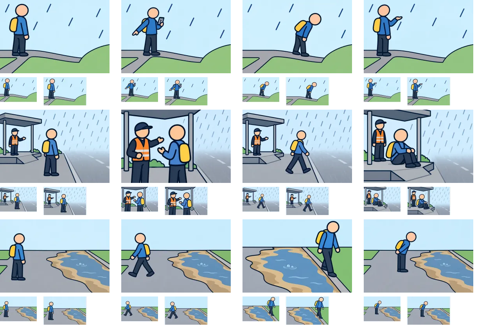

# 制作2組目：坂・強い雨・水と砂

問題8・10・16を各4枚、計12枚作成した。内蔵画像生成（built-in imagegen）で状況図を作り、同じ問の行動3枚はその状況図を参照して個別に生成。ゲームへの組み込みは未実施。

上から問題8・10・16。左から状況・distance（問題10はdetour）・go・consider。各画像の下は94×64pxと112×72px。シートを原寸で開くと実際の小ささで比較できる。

| 問題 | 確認結果 | 文で補う条件・残る制約 |
| --- | --- | --- |
| 8：下り坂の先が見えない | 初稿の小さな人物を拡大。端末で確認、坂へ入ってのぞく、入口で雨を見る姿勢を区別できる。 | 遠回り5分、避難情報の内容。坂の傾きは穏やかで、低地の見通しは本文も併用。端末内の細部は縮小時には読ませない。 |
| 10：雨が強まり先が見えにくい | 高い待機場所と見通しの悪い道を区分。案内員との会話、雨の中を歩く、座って雨宿りの形を区別できる。 | 移動継続・避難先を見直す会話内容、雨が弱まったら再開する意図。屋根とスロープは待機場所を示すための想定上の具体化。案内員の手は命令の向きを確定するものではない。 |
| 16：水と砂が出る道路 | 初稿の排水口に見える形を除去。水・砂・乾いた端を分離し、戻る・端を歩く・手前で待つを区別した。 | 沈みや水の出方の細部は94pxでは読みづらい。水たまりとの違い、地盤の状態は本文を併用する。水深や通行の安全性を図で保証しない。 |

3問とも太い輪郭と大きい人物を維持した。地形や会話の細部には文章の補助が必要。行動図は寄りの構図を使っており、背景の比率や人物の寸法は4枚で完全一致ではない。縮小シートの目視確認と、12枚の選択肢ID対応・960×640px WebP形式・デコードを確認した。画像だけの制作のため、アプリのテストやビルドは再実行していない。

## 保存先

- [問題8](../../public/illustrations/evac/walk-case-8/)：situation・distance・go・consider の4枚。
- [問題10](../../public/illustrations/evac/walk-case-10/)：situation・detour・go・consider の4枚。
- [問題16](../../public/illustrations/evac/walk-case-16/)：situation・distance・go・consider の4枚。
- [生成指示・参照画像・修正履歴](batch-02-prompts-v2.json)

12枚合計317,958バイト。v2は承認済みの電線V2の画風方針を表す。元PNGは内蔵ツールの生成先に残し、プロジェクトにはWebPを保存した。比較用の新しいアプリ画面は作成していない。

電線と先行3問を合わせ、7問28枚が作成済み。通常問題の残りは23問92枚。次の制作組は問題11・12・15。
