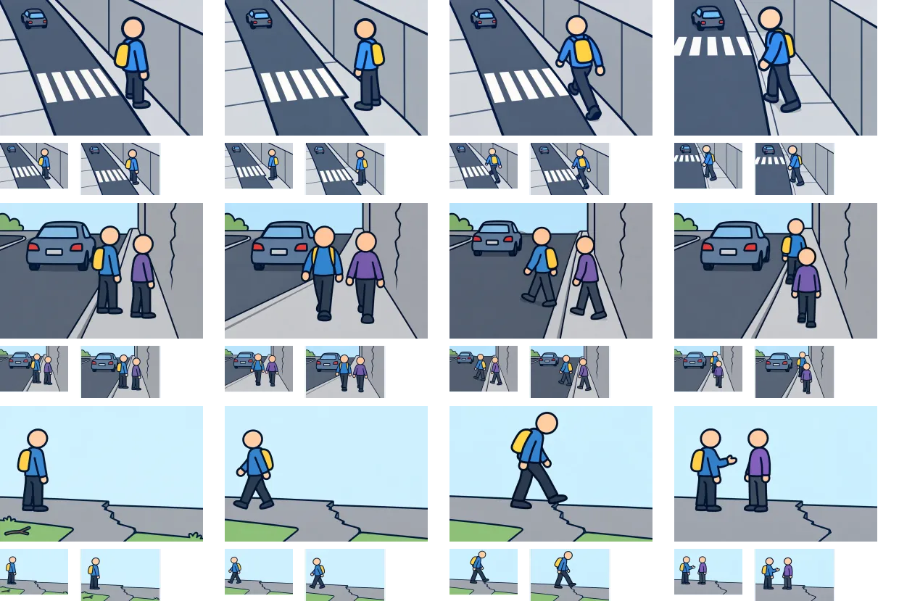

# 制作3組目：塀・車・道路の亀裂

問題11・12・15を各4枚、計12枚作成。内蔵画像生成（built-in imagegen）で1枚ずつ生成し、V2の太線を踏襲した。ゲームへの組み込みは未実施。

上から問題11・12・15、左から状況・distance・go・consider。各画像の下は94×64pxと112×72pxの縮小表示。シートを原寸で開くと比較できる。

| 問題 | 確認・修正した点 | 文章で補う点・残る制約 |
| --- | --- | --- |
| 11：高い塀沿いの道 | 初稿から線と人物を拡大し、状況図の靴と縁石の重なりを修正。横断位置での確認、塀沿いの歩行、車道側の歩行を作成。 | 縮小すると塀からの間隔や歩く速さの差は弱い。体の向きと選択肢文を併用する。車道側の案では寄り方と横断位置の見え方が変わり、厳密な背景固定には至っていない。 |
| 12：塀と車の間を通るか | 二人で戻る、主人公が車道へ出る、一列で歩道を進むという配置を区別。車道を濃い灰色、歩道を明るい灰色にした。 | 二人が並ぶのは狭い区間へ入る前の入口。手前の角への戻り先と交通の切れ目は本文も併用する。前後関係は分かるが、足の細かな重なりは縮小で読み取りづらい。 |
| 15：細く見える道路の亀裂 | 細い亀裂と低い段差を保ち、戻る・渡り始める・人に聞くを区別。地中の空洞や大穴を足していない。 | 地下の状態、低い段差を選ぶ意図は文で補う。状況図だけに小枝・草が残るが、選択肢の意味を担う要素ではない。 |

PNG出力と縮小比較シートを目視し、12枚の選択肢ID対応、960×640px WebP形式、デコードを確認した。12枚合計312,046バイト。画像制作のみのため、アプリのテストやビルドは再実行していない。

## 保存先

- [問題11](../../public/illustrations/evac/walk-case-11/)：situation・distance・go・consider。
- [問題12](../../public/illustrations/evac/walk-case-12/)：situation・distance・go・consider。
- [問題15](../../public/illustrations/evac/walk-case-15/)：situation・distance・go・consider。
- [生成指示・参照画像・修正履歴](batch-03-prompts-v2.json)

元PNGは内蔵ツールの生成先に保持し、プロジェクトにはWebPを保存。新しい確認用ページは作成していない。今回で通常問題30問中10問40枚が作成済み、残り20問80枚。次の制作組は13・17・20。
