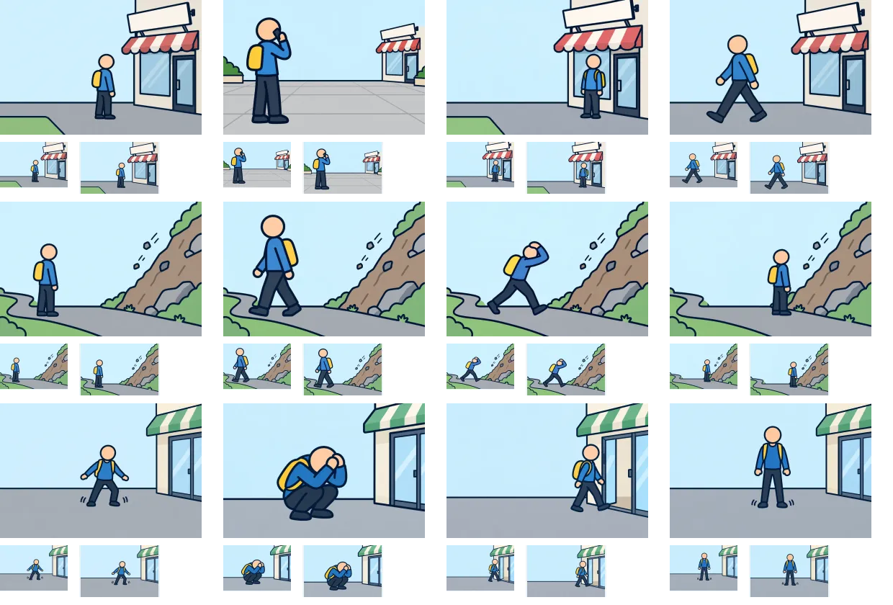

# 制作4組目：問題13・17・20

3問12枚を内蔵画像生成（built-in imagegen）で1枚ずつ制作。V2の太い輪郭を参照し、960×640pxのWebP（品質85）として保存した。ゲームへの組み込みは未実施。

上から問題13・17・20、左から状況・distance・go・consider。各画像の下は94×64pxと112×72pxの縮小表示。原寸で開いて比較できる。

| 問題 | 確認・修正した点 | 文章で補う点・残る制約 |
| --- | --- | --- |
| 13：看板の下で待ち合わせ（想定） | 看板下の待機、離れた広場で電話、立ち去る姿を区別。 | 待ち合わせ変更や連絡内容は文で補う。 |
| 17：斜面の下を通る近道（想定） | 斜面と小石を右に置き、離れる・頭を守って進む・手前で待つを区別。 | 見上げる意図や待機時間は文を併用する。 |
| 20：避難中に再び揺れたら（想定） | しゃがんで頭を守る、店へ入る、立ち止まる姿を作成。 | 揺れの継続や判断理由は文で補う。 |

生成画像と縮小シートを目視確認した。細かな意図や条件は選択肢文との併用が必要。全体のファイル検証結果は[制作結果一覧](remaining-review-v2.md)を参照。

[生成指示・参照画像・保存先](batch-04-prompts-v2.json)。元PNGはツールの生成先に保持し、WebPをプロジェクト内の `public/illustrations/evac/walk-case-番号/` に保存している。

