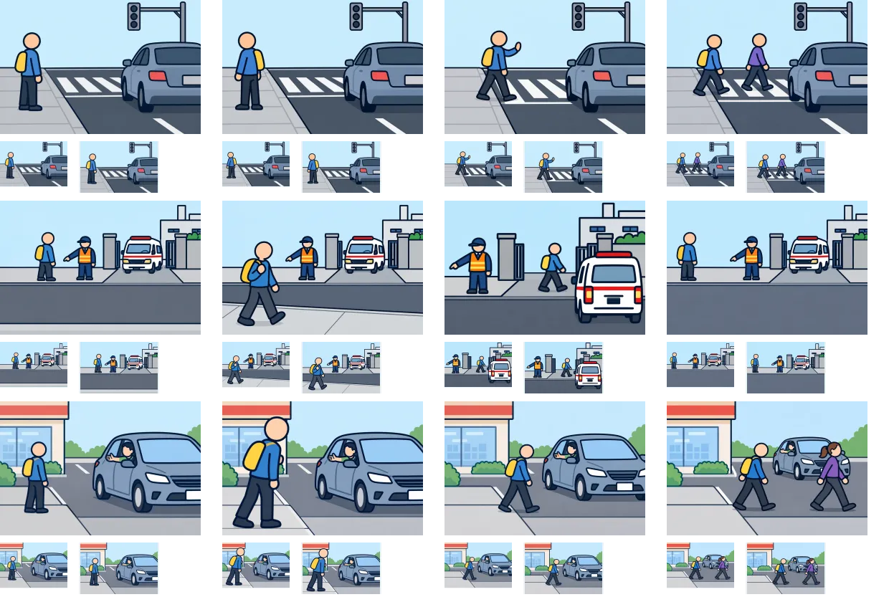

# 制作5組目：問題19・32・36

3問12枚を内蔵画像生成（built-in imagegen）で1枚ずつ制作。V2の太い輪郭を参照し、960×640pxのWebP（品質85）として保存した。ゲームへの組み込みは未実施。

上から問題19・32・36、左から状況・distance・go・consider。各画像の下は94×64pxと112×72pxの縮小表示。原寸で開いて比較できる。

| 問題 | 確認・修正した点 | 文章で補う点・残る制約 |
| --- | --- | --- |
| 19：信号の消えた交差点（想定） | 消えた信号と車の陰を残し、歩道待機・手を上げて横断・同行者に続く足位置を区別。 | 車の陰の状況は描き足していない。確認する方向は文を併用する。 |
| 32：緊急車両が出入りする門（想定） | 状況図の人物を門と同じ側へ修正。反対側の歩道、門前の横断、門から離れた待機を区別。 | 状況・待機図は人物が小さめ。車両の向きや距離の厳密な固定には至らず、組み込み時に配置を再確認する。 |
| 36：止まった車と歩行者（想定） | 運転者の合図と、歩道で確認・車の前を横断・同行者に続く姿を作成。 | 確認対象や見えない車は文で補う。横断図は車の奥行き位置が変わる。 |

生成画像と縮小シートを目視確認した。細かな意図や条件は選択肢文との併用が必要。全体のファイル検証結果は[制作結果一覧](remaining-review-v2.md)を参照。

[生成指示・参照画像・保存先](batch-05-prompts-v2.json)。元PNGはツールの生成先に保持し、WebPをプロジェクト内の `public/illustrations/evac/walk-case-番号/` に保存している。

