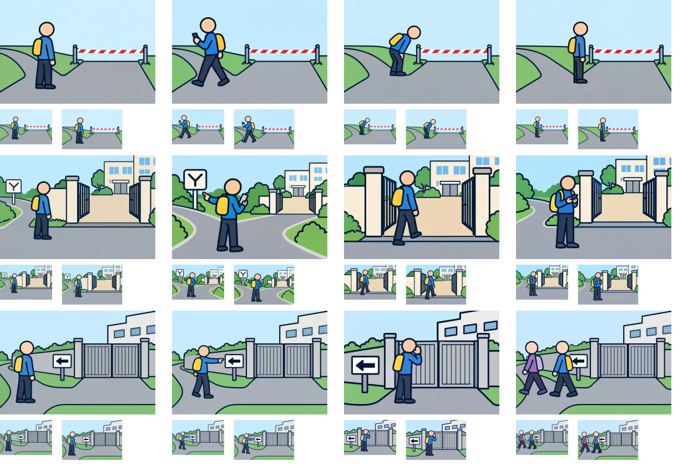

# 制作6組目：問題21・22・29

3問12枚を内蔵画像生成（built-in imagegen）で1枚ずつ制作。V2の太い輪郭を参照し、960×640pxのWebP（品質85）として保存した。ゲームへの組み込みは未実施。

上から問題21・22・29、左から状況・detour・go・consider。各画像の下は94×64pxと112×72pxの縮小表示。原寸で開いて比較できる。

| 問題 | 確認・修正した点 | 文章で補う点・残る制約 |
| --- | --- | --- |
| 21：予定の道に規制線（想定） | 規制線を固定し、別ルートへ移動・かがんで覗く・線の前で待つを区別。 | 規制の理由や情報の確認内容は文で補う。 |
| 22：通り抜けられそうな敷地（想定） | 門の内外を路面色と敷居で区別。分岐へ戻る、門へ入る、門外で端末確認を作成。 | 通り抜けの可否を画像で断定しない。 |
| 29：見えている施設の入口（想定） | 閉じた門と左向きの案内を共通化。案内確認、門へ呼びかけ、他の人について行く姿を作成。 | 案内確認図は歩き始める前の姿。行き先と確認の意図は文を併用する。 |

生成画像と縮小シートを目視確認した。細かな意図や条件は選択肢文との併用が必要。全体のファイル検証結果は[制作結果一覧](remaining-review-v2.md)を参照。

[生成指示・参照画像・保存先](batch-06-prompts-v2.json)。元PNGはツールの生成先に保持し、WebPをプロジェクト内の `public/illustrations/evac/walk-case-番号/` に保存している。

