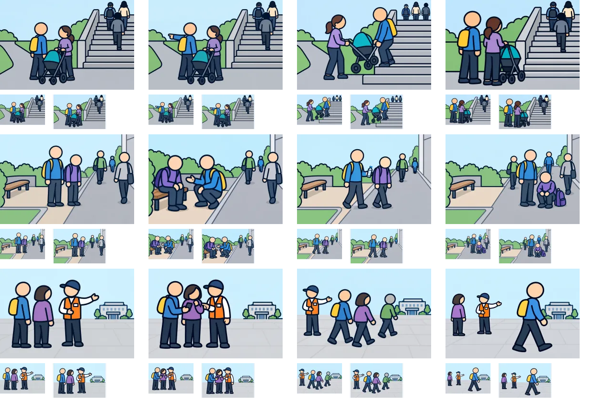

# 制作7組目：問題24・25・30

3問12枚を内蔵画像生成（built-in imagegen）で1枚ずつ制作。V2の太い輪郭を参照し、960×640pxのWebP（品質85）として保存した。ゲームへの組み込みは未実施。

上から問題24・25・30、左から状況・distance・go・consider。各画像の下は94×64pxと112×72pxの縮小表示。原寸で開いて比較できる。

| 問題 | 確認・修正した点 | 文章で補う点・残る制約 |
| --- | --- | --- |
| 24：階段の近道と同行者（想定） | 中立の状況図を作り直し、平坦な道を指す初稿をdistanceに採用。階段で持ち上げる姿と地上で待つ姿を区別。 | 階段利用の条件や相談内容は文で補う。 |
| 25：疲れた同行者と休憩場所（想定） | 脇のベンチで相談、飲み物を渡して進む、通行帯でしゃがむ姿を区別。 | 疲労の程度や休憩時間は文を併用する。 |
| 30：受付が別の場所へ移ったら（想定） | 同行者・係員との相談、二人で移動、一人で先に行く配置を作成。 | 受付変更の説明や分かれて行動する意図は文で補う。 |

生成画像と縮小シートを目視確認した。細かな意図や条件は選択肢文との併用が必要。全体のファイル検証結果は[制作結果一覧](remaining-review-v2.md)を参照。

[生成指示・参照画像・保存先](batch-07-prompts-v2.json)。元PNGはツールの生成先に保持し、WebPをプロジェクト内の `public/illustrations/evac/walk-case-番号/` に保存している。

