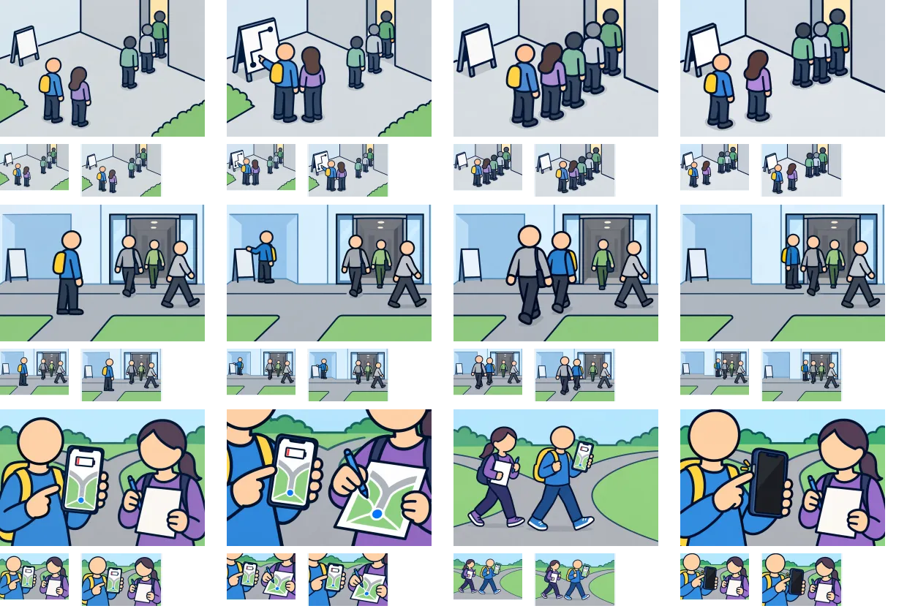

# 制作8組目：問題26・35・28

3問12枚を内蔵画像生成（built-in imagegen）で1枚ずつ制作。V2の太い輪郭を参照し、960×640pxのWebP（品質85）として保存した。ゲームへの組み込みは未実施。

上から問題26・35・28、左から状況・distance・go・consider。各画像の下は94×64pxと112×72pxの縮小表示。原寸で開いて比較できる。

| 問題 | 確認・修正した点 | 文章で補う点・残る制約 |
| --- | --- | --- |
| 26：狭い通路への人の流れ（想定） | 行列へ詰める姿と間隔を空ける姿を区別。間隔の図は人物配置を修正して再生成。 | 人数は保つが立ち位置は完全には固定されていない。適切な距離を縮尺で示すものではない。 |
| 35：建物の出口と歩道の流れ（想定） | 脇の案内板で確認、流れについて歩く、出口脇で待つ姿を作成。 | 待機図の人物が小さめ。出口との位置関係と選択肢文を併用する。 |
| 28：電池が残りわずか（想定） | 端末・紙・手を大きくし、紙へ記録、地図を表示して歩行、画面を消す操作を区別。 | 紙の地図は模式図。記録内容やスクリーンショット済みの条件は文で補う。 |

生成画像と縮小シートを目視確認した。細かな意図や条件は選択肢文との併用が必要。全体のファイル検証結果は[制作結果一覧](remaining-review-v2.md)を参照。

[生成指示・参照画像・保存先](batch-08-prompts-v2.json)。元PNGはツールの生成先に保持し、WebPをプロジェクト内の `public/illustrations/evac/walk-case-番号/` に保存している。

