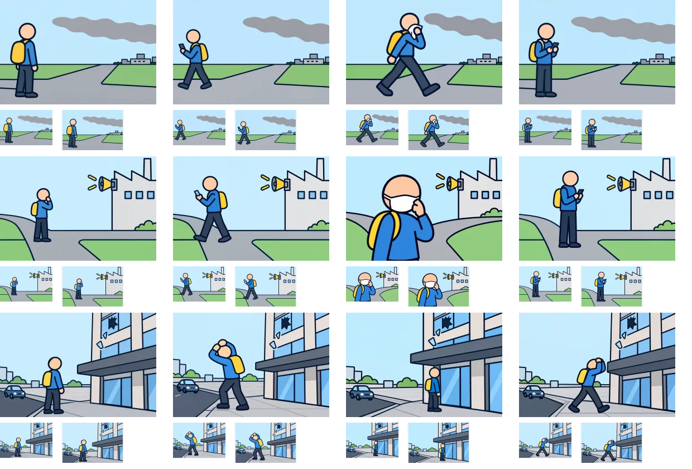

# 制作9組目：問題31・33・34

3問12枚を内蔵画像生成（built-in imagegen）で1枚ずつ制作。V2の太い輪郭を参照し、960×640pxのWebP（品質85）として保存した。ゲームへの組み込みは未実施。

上から問題31・33・34、左から状況・distance・go・consider。各画像の下は94×64pxと112×72pxの縮小表示。原寸で開いて比較できる。

| 問題 | 確認・修正した点 | 文章で補う点・残る制約 |
| --- | --- | --- |
| 31：工場の方向に煙（想定） | 煙突と煙を接続した初稿を修正し、煙の発生源を特定しない構図へ変更。離れる、口を覆って進む、端末確認を作成。 | 煙の物質や風向きは画像から断定しない。 |
| 33：異臭と警報に気づいたら（想定） | 警報器と鼻を覆う姿を作成。マスクの図は顔の描き込みを除いて再生成。 | 臭いや気体を着色して可視化していない。移動意図は文を併用する。 |
| 34：高い建物からの破片（想定） | 建物を切り取り、破片・ひさし・車道の位置を明示。横断前の確認、ひさし下の待機、歩道上の前進を区別。 | ひさし下の人物は小さめ。交通確認や待機理由は文で補う。 |

生成画像と縮小シートを目視確認した。細かな意図や条件は選択肢文との併用が必要。全体のファイル検証結果は[制作結果一覧](remaining-review-v2.md)を参照。

[生成指示・参照画像・保存先](batch-09-prompts-v2.json)。元PNGはツールの生成先に保持し、WebPをプロジェクト内の `public/illustrations/evac/walk-case-番号/` に保存している。

