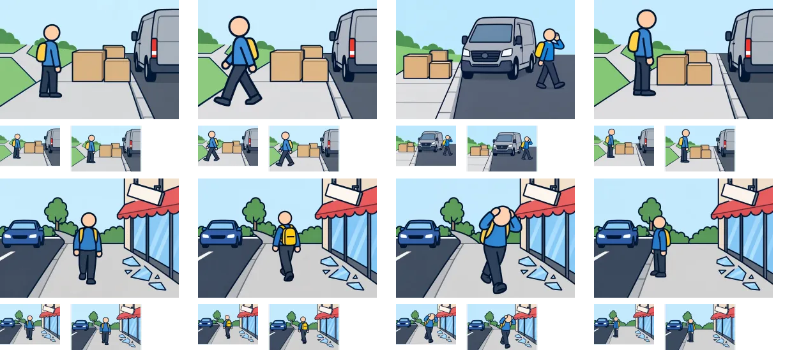

# 制作10組目：問題37・38

2問8枚を内蔵画像生成（built-in imagegen）で1枚ずつ制作。V2の太い輪郭を参照し、960×640pxのWebP（品質85）として保存した。ゲームへの組み込みは未実施。

上から問題37・38、左から状況・distance・go・consider。各画像の下は94×64pxと112×72pxの縮小表示。原寸で開いて比較できる。

| 問題 | 確認・修正した点 | 文章で補う点・残る制約 |
| --- | --- | --- |
| 37：荷物で歩道が狭い（想定） | 荷物・縁石・車を描き分け、戻る、車道側を回る、荷物の前で待つ姿を作成。 | 車道側の図は視点と車の向きが変わる。両足が車道上にあることを確認。 |
| 38：店先の破片と車道（想定） | 看板・ガラス・車道を分離し、戻る、頭を守って進む、縁石前で待つ姿を作成。 | 戻り先の分岐は明瞭ではなく、進行方向と選択肢文を併用する。 |

生成画像と縮小シートを目視確認した。細かな意図や条件は選択肢文との併用が必要。全体のファイル検証結果は[制作結果一覧](remaining-review-v2.md)を参照。

[生成指示・参照画像・保存先](batch-10-prompts-v2.json)。元PNGはツールの生成先に保持し、WebPをプロジェクト内の `public/illustrations/evac/walk-case-番号/` に保存している。

