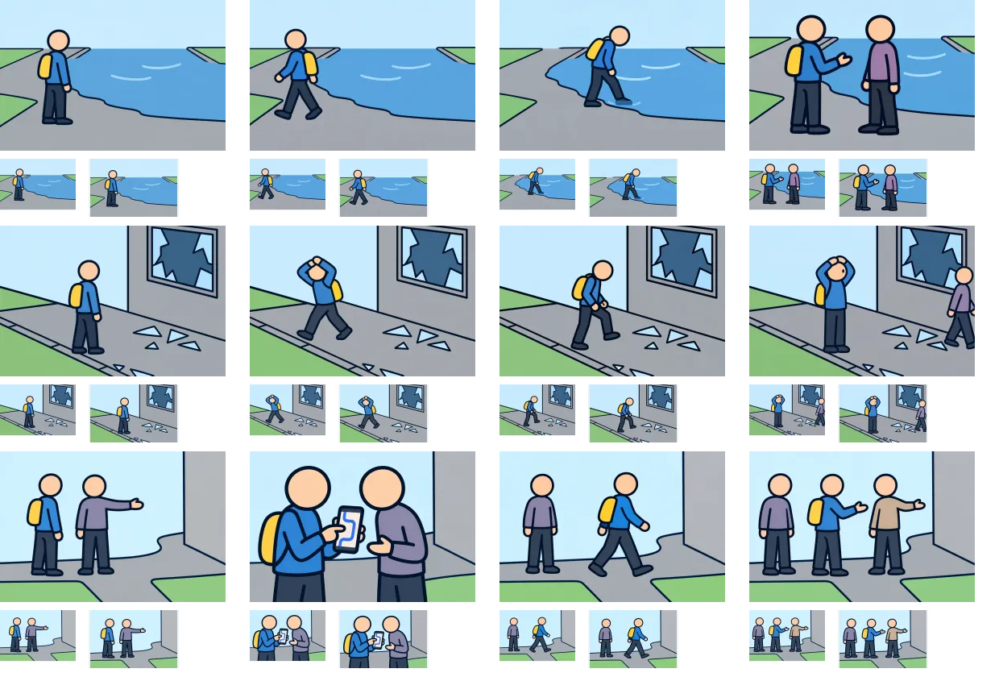

# V2方針：先行3問の試作レビュー

ステップ2として、問題9・14・27の状況図と3択の行動図を、内蔵画像生成（built-in imagegen）で1枚ずつ作成した。計12枚。ゲームへの組み込みは未実施で、これら3問は引き続き既存SVGで表示される。電線のV2表示は維持する。

## 比較シート

上から問題9・14・27。左から状況・最初の保存選択肢・go・consider。各画像の下には94×64pxと112×72pxの縮小表示を置いた。ブラウザがシートを縮める場合は画像を原寸で開いて確認する。実際の選択肢の並び順はシャッフルされる。

## 確認結果

| 問題 | 小さくしても残る違い | 文章で補う点・残る制約 |
| --- | --- | --- |
| 9：近道に水がたまっている | 不透明な水面と乾いた路面、戻る歩行姿勢、水際への一歩、二人の会話 | 避難先まで200m、浅そうな端を選ぶ意図、水底の不明さ。乾いた分岐と水際の位置は生成間で少し変化しており、測量図として扱わない。 |
| 14：足元のガラスと頭上 | 大きな割れた窓、頭を守って左へ歩く姿勢、足元を見て右へ進む姿勢、頭を守って直立する姿勢 | 靴底と交通の確認は絵だけでは伝わらない。94pxでは小さい破片や視線は読み取りづらい。直立案にのみ小さな目が生成されており、今後統一を詰める余地がある。 |
| 27：「通れた」という知らせ | 端末を囲む二人、右へ歩き出す主人公、別の相手を含む三人 | 聞いた時刻・区間・規制情報との照合、同じ意見の多さで選ぶ意図は選択肢文を併用。端末の案は寄りの構図なので、他案より人物が大きい。今後は他の会話案にも寄りを試せる。 |

V2の太い輪郭と人物を優先する方針で、異なる題材にも展開できた。一方、全景を94pxに縮めるだけでは判断条件のすべては表せない。以後も状況と行動の主な違いを絵で示し、時間・情報内容・確認の意図は短い文章に任せる。

次の制作へ進める前の見た目確認用の初版。全問題への展開完了や実画面での使いやすさ検証完了を意味しない。今回はPNG原寸と縮小比較シートを目視し、ファイルの寸法・デコード・選択肢ID対応を機械的に照合した。

## 保存先と生成記録

- [問題9の画像](../../public/illustrations/evac/walk-case-9/)：situation・detour・go・consider の4枚。
- [問題14の画像](../../public/illustrations/evac/walk-case-14/)：situation・distance・go・consider の4枚。
- [問題27の画像](../../public/illustrations/evac/walk-case-27/)：situation・distance・go・consider の4枚。
- [全12枚の生成指示と参照画像・出力対応](pilot-prompts-v2.json)。各問の状況図を行動図の参照に使用した。

プロジェクト用画像は960×640pxのWebP、12枚合計331,604バイト（約324KiB）。ファイル名のv2は電線V2に合わせた画風方針を示す。PNG原本は内蔵ツールの生成先に保持し、プロジェクトではWebPを使用する予定。新しい確認用ページは作成していない。
